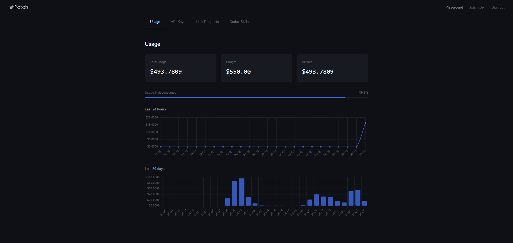

# Patch Usage for Claude

Ask Claude how much of your [Patch](https://oai.joinpatch.org) API budget you have used, straight from your chat. No more opening the dashboard and squinting at charts.

> "How much of my Patch budget is left this month?"
>
> "Am I going to run out before it resets?"
>
> "Show me my spend for the last week."

This is a small **MCP server**. MCP (Model Context Protocol) is just a safe way to give Claude an extra skill. Once it is installed, Claude can read your Patch usage for you. It can only **read** your data unless you explicitly ask it to do something more (see [Safety](#safety)).

## What it shows you

It reads the exact same numbers you see on your Patch dashboard:



Plus a few things the dashboard does not show, like a projection of **when you will run out** at your current pace.

---

## Setup (about 5 minutes, no coding needed)

There are two steps: **(1)** install a small helper program, then **(2)** give Claude your Patch sign-in so it can read your usage.

### Step 1: Install `uv` (one time)

`uv` is a tiny tool that runs the server. You only ever do this once.

Open **PowerShell** (press the Windows key, type `PowerShell`, press Enter) and paste this line:

```powershell
powershell -ExecutionPolicy ByPass -c "irm https://astral.sh/uv/install.ps1 | iex"
```

Close and reopen PowerShell when it finishes. (On a Mac, paste `curl -LsSf https://astral.sh/uv/install.sh | sh` into the Terminal instead.)

### Step 2: Get your Patch token

This is the key that lets the server read **your** usage and nobody else's.

1. Go to <https://oai.joinpatch.org> and sign in.
2. Press **F12** to open the developer panel, then click the **Console** tab.
3. Click into the console, type this, and press Enter:
   ```js
   localStorage.getItem('patch_token')
   ```
4. It prints a long line of letters in quotes (it starts with `eyJ...`). Copy everything **between** the quotes.

Keep that copied. You need it in the next step.

### Step 3: Connect it to Claude

In PowerShell, paste the command below, but **replace `PASTE_YOUR_TOKEN_HERE`** with the token you just copied:

```powershell
claude mcp add patch-usage --scope user --env PATCH_TOKEN=PASTE_YOUR_TOKEN_HERE -- uv run --directory "C:/Users/heliosfr/Documents/workspaces/v2/mcp-patch" patch-usage-mcp
```

That is it. **Restart Claude** (close it and open it again) and just ask: *"How much of my Patch budget have I used?"*

To check it worked, run `claude mcp list` and look for `patch-usage: ... Connected`.

---

## Keeping it working: refreshing your token

Your Patch token expires every few days for security. When it does, Claude will tell you the token has expired and show you what to do. To fix it, get a fresh token (repeat **Step 2** above) and run:

```powershell
claude mcp remove patch-usage --scope user
```

Then run the **Step 3** command again with the new token. That is the whole refresh.

---

## What you can ask for

Every value is in US dollars. Everything in the first three groups is read-only.

### Usage and account
| Ask Claude about... | Tool | What you get |
|---|---|---|
| Budget, spend, percent used | `get_usage_summary` | Monthly limit, spend this month, all-time spend, reset date, throttle status, remaining, percent used |
| Spend per day | `get_usage_daily` | The last ~30 days, one figure per day |
| Spend per hour | `get_usage_hourly` | The last ~24 hours, one figure per hour |
| Your account | `get_account` | Your name, email, when you joined |
| Your API keys | `list_api_tokens` | Each key's name, prefix, and dates (never the full secret) |
| Your limit requests | `list_rate_limit_requests` | Each budget-increase request and whether it was approved |

### Smart insights
| Ask Claude... | Tool | What you get |
|---|---|---|
| "Will I run out before reset?" | `get_burn_rate` | Average daily spend, projected month-end total, projected overage, and the date you are on track to run dry |
| "Give me the full picture" | `get_spend_report` | Everything above in one tidy summary, ready to read |

### Managing API keys (optional, guarded)
| Ask Claude... | Tool | Notes |
|---|---|---|
| "Create a new API key" | `create_api_token` | Makes a live key. The secret is shown only once. |
| "Revoke a key" | `revoke_api_token` | Permanently deletes a key. |

---

## Safety

The two key-management tools can change your account, so they have two locks on them:

1. They are flagged as **destructive**, so Claude asks your permission before running them.
2. They do **nothing** on the first call. They only show you a preview of what would happen. They act only when you confirm. So a key can never be created or deleted by accident.

For the strongest protection, do not add `create_api_token` or `revoke_api_token` to any "always allow" list, so Claude always asks first.

A few things were left out on purpose:

- **Requesting a budget increase** is not included, because a real person on the Patch team reviews those. Asking for one should be a deliberate human action, not something Claude does. You can still **see** your requests with `list_rate_limit_requests`.
- **Admin tools** are not included. This account is not an admin, so they would not work anyway.

---

## For developers

```
src/patch_usage_mcp/
  client.py      Authenticated HTTP client. Maps every failure to a clear message.
  analytics.py   Pure functions for burn-rate and spend-report math (no network).
  server.py      The MCP server: wires endpoints to tools, sets safety annotations.
tests/           Unit tests (mocked HTTP, no live token needed).
```

Run the test suite:

```bash
uv sync --extra dev
uv run pytest
```

Configuration is via environment variables: `PATCH_TOKEN` (required) and `PATCH_BASE_URL` (optional, defaults to `https://oai.joinpatch.org/api`).

If you prefer to register the server by hand, add this to your MCP config instead of using `claude mcp add`:

```json
{
  "mcpServers": {
    "patch-usage": {
      "command": "uv",
      "args": ["run", "--directory", "C:/Users/heliosfr/Documents/workspaces/v2/mcp-patch", "patch-usage-mcp"],
      "env": { "PATCH_TOKEN": "eyJhbGci...yourtoken..." }
    }
  }
}
```
